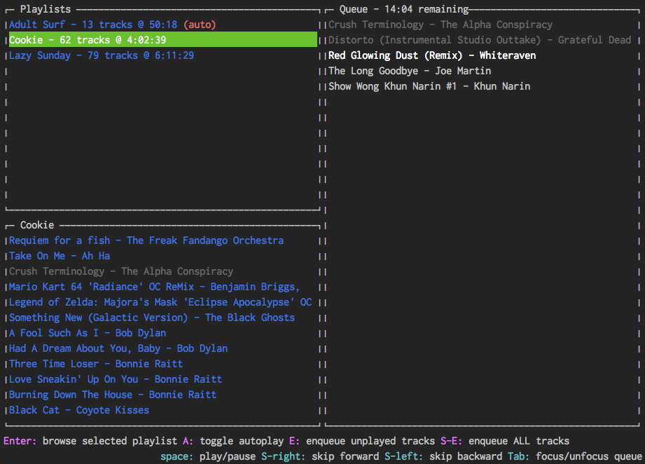

# djesbe

Terminal based audio player for Node.js. Written to solve my very specific problem: how to DJ my own party maintaining an easy to view record of all the songs I had already played.

## App

`dj [path/to/playlists]` loads djesbe as a terminal app. Path can be left blank to scan the current directory.

The top left pane is a list of `m3u8` files that the app found and parsed. The lower left pane is a list of tracks in the selected playlist. The right pane is the actual queue of tracks to play. As tracks get enqueued, they are grayed out from the track pane (though they are still playable).

From anywhere
* `tab` toggles focus between the queue and the selection panes
* `space` starts and stops the current track in the queue
* `shift-right` and `shift-left` skip forward and backward in the queue

From the playlist pane (app starts with it focused)
* `enter` selects a playlist and expands the track pane
* `a` marks a playlist as "autoplay." The jukebox will pull from this list if the queue runs dry
* `e` enqueues all tracks at once, ignoring those already queued up. `shift-e` enqueues everything without checking

From the track pane
* `enter` enqueues a track
* `escape` shrinks the pane and returns focus to the playlist pane
* `e` and `shift-e`, as above

From the queue
* `enter` skips directly to the selected track and plays it
* `delete` and `backspace` removes that track from the queue

## Library

If this module is required from within node, it will just expose `Jukebox` and `Track`. Most of the async flow is controlled (poorly, at the moment) by promises.

`Jukebox.load(directory)` parsed all of the `m3u8` files in the specified directory, turning them into arrays of `Track`s. It returns a promise.

`Track.unique` is a constructor that memoizes tracks by filename, so that multiple playlists can load duplicates of the same file without generating multiple copies of it in memory.

A `Track` is responsible for playing itself with the `play`, `stop`, and `isPlaying` methods.

A `Jukebox` loads the playlists, maintains the queue of tracks to play, and keeps the queue playing tunes. It has `enqueue`, `play`, and `stop` methods that each take a `Track` object as their only argument; they also handle the callbacks that enable the next track in the queue to autoplay. The `unqueue` method is tricky because even though it should accept a `Track`, it accepts an index instead (the queue must be able to contain duplicate tracks, so it need to know which index is being removed from the queue). `Jukebox.advance` takes an integer, positive or negative, and skips that many tracks ahead or behind in the queue.

# To do

1. The queue needs its own model to move logic out of Jukebox
2. AAC support
3. "undo" levels (maybe just 1)
4. websocket interface?

# Bites

Currently supports only `mp3` and `ogg` files. (It will filter out extensions that it does not support.)

Some of the architecture has come from poring over the [Decibel](https://github.com/scttnlsn/decibel) project for insights.

A few alterations were made to [Blessed](https://github.com/chjj/blessed) as well, to accomodate how I preferred to use list boxes.

I meant to type "Notes" for this section but my right hand was off a letter.
